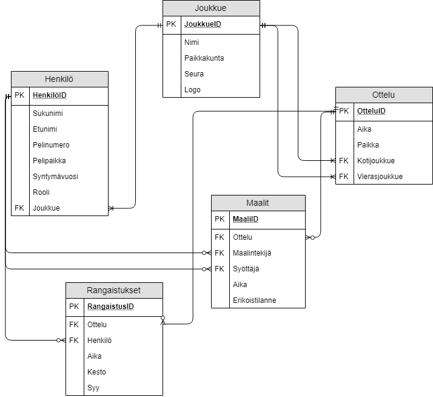
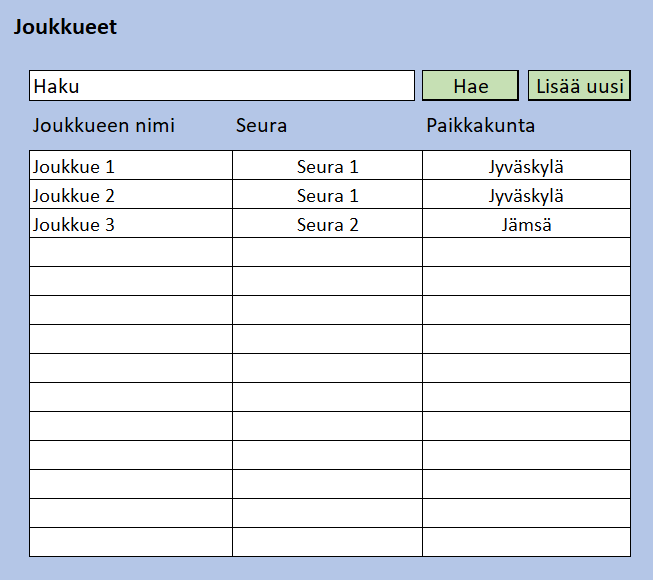
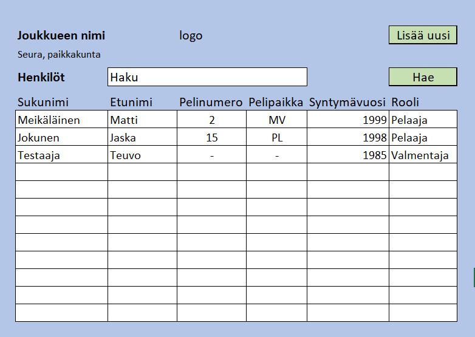
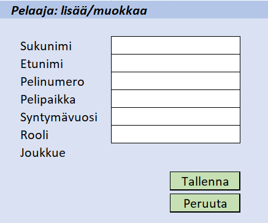
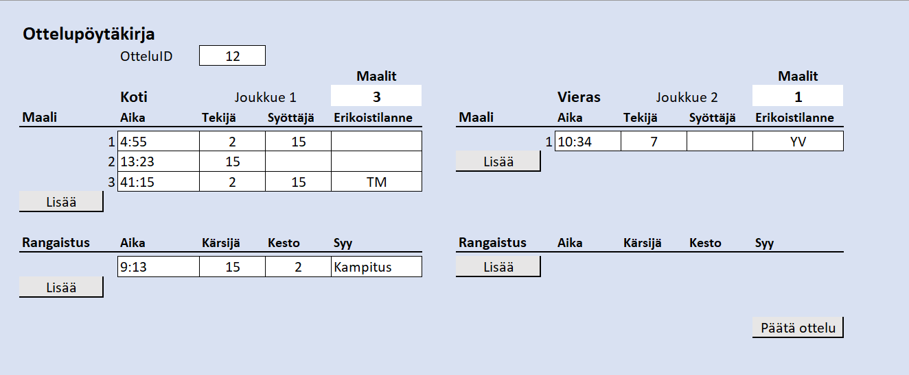

# Vaatimusmäärittely

## Johdanto

Tavoitteena on tehdä tietokanta, jossa voidaan hallita salibandysarjoja, niissä pelaavia joukkueita, otteluita, tuloksia ja muuta statistiikkaa.

## Toiminnot
### a. Pakolliset toiminnot
P1. Joukkuetietojen ylläpito (nimi, paikkakunta)
P2. Otteluohjelman ylläpito (pelaavat joukkueet, pvm, aika, paikka, sarja/lohko)
P3. Otteludatan ylläpito (tulos, maalit, rangaistukset, pisteet)
### b. Tärkeät toiminnot
T1. Pelaajatietojen ylläpito (nimi, pelinumero, synt.aika, joukkue)
T2. Pistepörssi, jäähypörssi yms. statistiikkaa

# Käsiteanalyysi

Tarkasteltavana ilmiönä on salibandyturnauksen tilastointi. Turnauksella tarkoitetaan tapahtumaa, jossa pelataan rajattu määrä otteluita joukkueiden välillä. Joukkue koostuu useammasta pelaajasta ja toimihenkilöistä. Turnauksessa on käytössä useampi kenttä, jolloin otteluita voidaan pelata samanaikaisesti. Ottelussa kirjataan maalit ja rangaistukset.

## Kohde-ehdokkaat

_Tarkasteltavana ilmiönä on salibandyturnauksen tilastointi. __Turnauksella__ tarkoitetaan tapahtumaa, jossa pelataan rajattu määrä __otteluita__ __joukkueiden__ välillä. __Joukkue__ koostuu useammasta __pelaajasta__ ja __toimihenkilöistä__. Turnauksessa on käytössä useampi __kenttä__, jolloin otteluita voidaan pelata __samanaikaisesti__. Ottelussa kirjataan __maalit__ ja __rangaistukset__._

| Ehdokas  | Analyysi  |
| -------- | --------- |
| Turnaus | Sisältää useita otteluita, tietokanta kokonaisuudessaan |
| Ottelu | Kahden joukkueen välillä, voi tulla useampia maaleja ja rangaistuksia, pakollinen |
| Joukkue | Otteluiden osanottajat, nimi, paikkakunta, seura |
| Pelaaja | Joukkueen jäsen, voi tehdä maalin/syöttää, saada rangaistuksen, nimi, pelinumero, pelipaikka, syntymävuosi |
| Toimihenkilö | Joukkueen jäsen, voi saada rangaistuksen, mutta ei voi tehdä maalia/syöttää |
| Kenttä | Pelipaikka |
| Samanaikaisesti | Pelin aloitusaika |
| Maali | Ottelussa voi tulla useampi, tekoaika, tekijä, syöttäjä, erikoistilanne, useamman tehnyt voittaa |
| Rangaistus | Ottelussa voi tulla useampi, aika, kärsijä, kesto, syy |

## ER-kaavio

# Käyttöliitymän prototyyppi

* Joukkueen valitseminen *

* Joukkueen muokkaus *

* Henkilön tietojen muokkaus *

* Ottelupöytäkirja *
