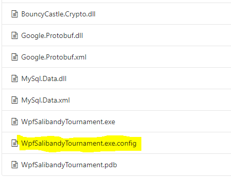
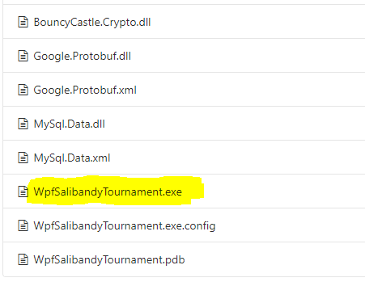
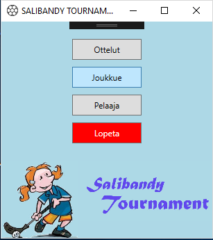
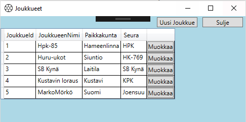
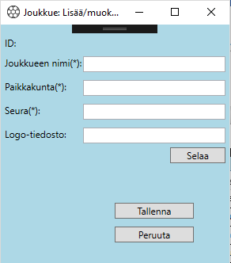
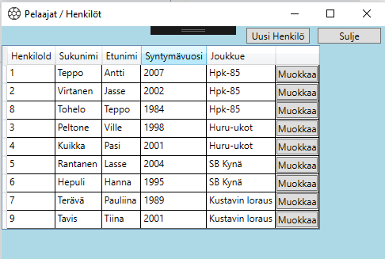
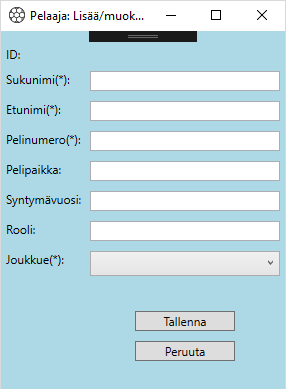
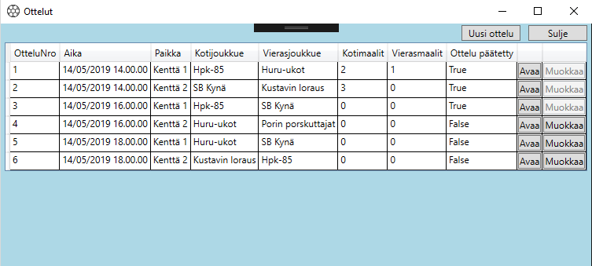
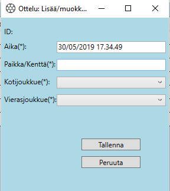
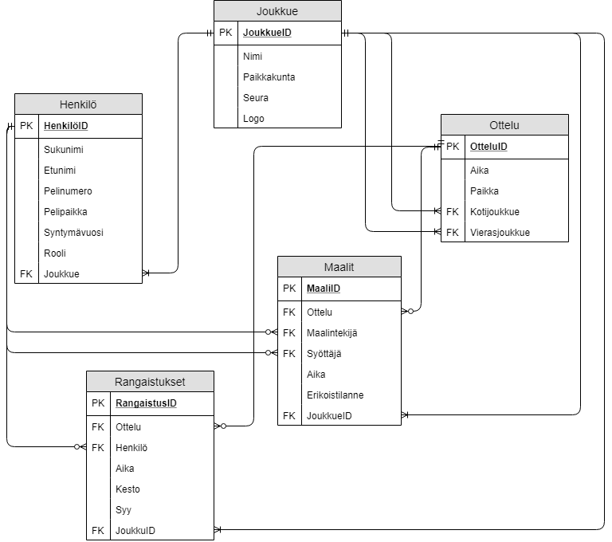

# Loppuraportti

## 1. Asennus

Käyttöliittymä/WpfSalibandyTournament/bin/Release

 
Muuta configurointi tiedostoon keltaiset kohdat:

### Avaa release tiedosto:

## 2. Tietoa ohjelmasta

Ohjelmalla voi ylläpitää ja toteuttaa salibandyturnauksen tulospalvelun sekä tuottaa ottelupöytäkirjat. Tulospalvelu sisältää otteluiden tulokset sekä joukkueiden tiedot. Ohjelmasta olisi helppo luoda esimerkiksi seuran jäsenrekisteri.

#### Toteutetut toiminnalliset vaatimukset:
-	Joukkueen lisääminen ja muokkaaminen
-	Pelaajan lisääminen ja muokkaaminen
-	Ottelun lisääminen ja muokkaaminen
-	Ottelupöytäkirjan tuottaminen

#### Toteuttamatta jääneet toiminnalliset vaatimukset:
-	Joukkueiden sarjataulukot, pistepörssi, jäähypörssi yms.

#### Toiminnallisuus joka toteuttiin ohi/yli alkuperäisten vaatimusten:
-	Pelaajan henkilökohtainen pisteseuranta, vaikka pelaaja vaihtaisi joukkuetta
-	Samoin joukkueen pisteet eivät ole sidottu pelaajaan

#### Ei-toiminnalliset vaatimukset sekä mahdolliset reunaehdot/rajoitukset:
-	useita samanaikaisia käyttäjiä, keskitetty tietokanta
-	ottelupöytäkirjaa ei voi muokata/käsitellä kuin yksi kerrallaan
-	käyttäjähallinta (ei toteutettu)
  *  pääkäyttäjä, täydet oikeudet
  *  toimitsija, rajalliset oikeudet (suurin käyttäjäryhmä)
  *  tulospalvelut, katseluoikeus
	
	
## 3. Kuvaruutukaappaukset tärkeimmistä käyttöliittymistä:

### Päävalikko:
 

#### Joukkueet käyttöliittymät:
-	Yleisnäkymässä näkyy automaattisesti kaikki tietokantaan tallennetut joukkueet.

-	Tähdellä merkityt ovat pakollisia tietoja

#### Pelaaja / Henkilöt käyttöliittymät:
-	Yleisnäkymässä näkyy automaattisesti kaikki tietokantaan tallennetut pelaajat.
 

#### Pelaaja: Lisää / muokkaa 
-	Tähdellä merkityt ovat pakollisia tietoja
 

#### Otteluiden käyttöliittymät:
-	Voit muokata vain päättämättömiä otteluita.
  

#### Uusi ottelu:
  

#### Ottelupöytäkirja:
-	Erän pituudeksi voi valita 10 sekuntia testikäyttöä varten.
-	Ottelun voi päättää vain kokonaisajan päättymisen jälkeen.

## 4. Ohjelman tarvitsemat /mukana tulevat tiedostot/tietokannat

### Tietokannan ER-kaavio
 
 
### Luontiskriptit ja testidatan lisäysskriptit:
  

#### Huomioitavaa käytössä:
-	Katso ottelupöytäkirjan käyttöohje

## 5. Tiedossa olevat ongelmat ja bugit sekä jatkokehitysideat

#### Ongelmat ja bugit:
-	datan syöttämisen rajoitteet/laadun varmistukset ovat osittain puutteellisia

#### Jatkokehitysideat:
-	Erilaiset käyttäjäryhmät ja niille omat oikeudet
-	Turnausmuodosta mahdollisuus myös sarjamuotoihin
-	Ottelukaavioiden luominen automaattisesti
-	Pelaajien haku toiminnot esim. vain yhden joukkueen pelaajat
-	Tilastoihin oma nappula, jonka taakse pistepörssit yms.
-	Mahdollinen jatkoaika, miten toteutetaan ottelupöytäkirjaan?
-	Joukkueen pelaajien tuonti tietokantaan suoraan excel-taulukosta
-	Peliajan säätämisen mahdollisuus kesken pelin
-	Visuaalisen ilmeen muokkaaminen käyttäjän mielen mukaan

## 6. Mitä opittu, mitkä olivat suurimmat haasteet, mitä kannattaisi tutkia/opiskella lisää jne

#### Opit: 
-	yhdessä tekeminen tuottaa paljon oppimista => pitää pyrkiä hyödyntämään myös jatko-opiskeluissa!
-	tietueiden järkevä muoto/tyypitys, jolla vältetään turhaa parserointia.
-	tietokannan pitää olla oikein toteutettu, jotta lopputulos voi toimia
-	tietokannan rajoitteiden toimivuus myös olioissa
-	loogisuuden tärkeys muuttujien ja painikkeiden nimeämisessä tuli nopeasti esiin
-	debuggauksen ymmärrys lisääntyy sekä sen avulla tehtyjen korjauksien määrä
-	ohjelman kehittäminen on jatkuvaa

#### Haasteet:
-	kurssiin sopivan kokonaisuuden hahmottaminen
-	ohjelman kehittämiselle ei näy loppua, mihin vetää rajan?
-	toisen tekemän koodin ymmärtäminen voi olla haastavaa
-	tekijöiden erilaiset lähtötasot

#### Lisäselvitykseen:
-	Käyttäjän hallinnan luominen

## 7. Tekijät, vastuiden ja työmäärän jakautuminen

-	Ryhmätyötä tehtiin fyysisesti samassa paikassa 6 kertaa 4-5 tuntia / kerta. Tämä todettiin erittäin onnistuneeksi ratkaisuksi oppimisen, edistymisen sekä tasaisemman työnjaon osalta. Yhteisien tapaamisten jälkeen sovittiin aina tehtävät ennen seuraavaa tapaamista. Hyväksi malliksi todettiin näytön jakaminen isommalle näytölle tai seinälle, jolloin kaikki pääsivät kiinni, mistä kohdasta milloinkin puhutaan.
-	Ryhmätyön tekemisessä hyödynnettiin GitLab -sovellusta ja sinne pushattiin sekä commitoitiin erityisesti tapaamisten väleissä.
-	Ryhmätyön onnistumisen kannalta Pauliinan osaaminen oli kaiken pohja. Kim ja Antti vastasivat helpommista ja selkeämmistä kokonaisuuksista, kuten käyttöliittymien näkymistä. Yhdessä sitten ratkottiin koodiin nousseita haasteita/ongelmia ja niiden ratkomisessa Pauliina oli korvaamaton.
-	Tehtävien selkeä jakaminen oli haasteellista, koska ryhmässä taitotasot olivat erilaiset.

## 8. Tekijöiden ehdotus arvosanaksi, ja perustelut sille
- Pauliinalle 5
- Pojille 3
